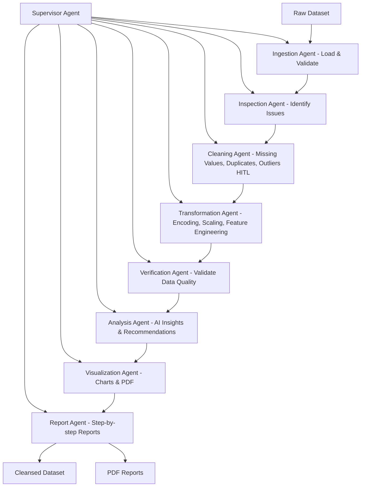

# 🤖 RTGS AI Analyst

**Real-Time Governance Systems AI Analyst** - A comprehensive multi-agent system for automated data quality analysis, cleaning, and reporting.

## 🎯 Overview

RTGS AI Analyst is an MVP (Minimum Viable Product) built for buildathons that demonstrates how AI can automatically analyze ANY raw dataset, identify quality issues, clean data, and generate professional reports. The system uses a **Supervisor-Agent architecture** with 8 specialized agents working together to transform raw data into analysis-ready datasets.

## ✨ Key Features

- 🔍 **Automated Data Quality Analysis** - Identifies missing values, duplicates, outliers, and type issues
- 🧹 **Intelligent Data Cleaning** - Human-in-the-loop cleaning with smart recommendations
- 🔄 **Data Transformation** - Feature engineering, encoding, and scaling for analysis readiness
- 🤖 **AI-Powered Insights** - Uses ChatGroq Llama-3.1-8B-Instant for intelligent analysis
- 📊 **Professional Visualizations** - Comparison charts showing before/after data quality
- 📋 **Comprehensive Reports** - Step-by-step PDF reports with recommendations
- 🎛️ **Interactive & Automated Modes** - Choose human oversight or full automation

## RTGS-AI-Analyst Workflow

This diagram shows the **Supervisor-Agent System** and the data processing workflow from raw dataset to cleaned outputs and reports.



## 🏗️ Architecture

### Supervisor-Agent System
The system uses a **Supervisor Agent** that orchestrates 8 specialized sub-agents:

1. **🔍 Ingestion Agent** - Loads and validates datasets (CSV, XLSX)
2. **🔎 Inspection Agent** - Identifies data quality issues and vulnerabilities  
3. **🧹 Cleaning Agent** - Handles missing values, duplicates, outliers (with HITL)
4. **🔄 Transformation Agent** - Applies encoding, scaling, feature engineering
5. **✅ Verification Agent** - Validates final data quality and consistency
6. **🧠 Analysis Agent** - Generates AI-powered insights and recommendations
7. **📊 Visualization Agent** - Creates comparison charts and exports to PDF
8. **📋 Report Agent** - Produces professional step-by-step analysis reports

### Workflow
```
Raw Dataset → Ingestion → Inspection → Cleaning (HITL) → Transformation → 
Verification → Analysis → Visualization → Report → Clean Dataset + PDFs
```

## 🚀 Quick Start

### Prerequisites
- Python 3.12+
- pip or uv package manager

### Installation

1. **Clone the repository:**
```bash
git clone <repository-url>
cd rtgs-ai-analyst
```

2. **Install dependencies:**
```bash
# Using pip
pip install -r requirements.txt

# Using uv (recommended)
uv sync
```

3. **Set up API keys (optional but recommended):**
```bash
# For ChatGroq (recommended - faster and cheaper)
export GROQ_API_KEY="your_groq_api_key"

# Or OpenAI (fallback)
export OPENAI_API_KEY="your_openai_api_key"
```

### Basic Usage

**Interactive Mode (Recommended for first time):**
```bash
python cli.py --file data/raw/Hospitals.csv
```

**Automated Mode (No human input required):**
```bash
python cli.py --file data/raw/Hospitals.csv --non-interactive
```

**Custom Configuration:**
```bash
python cli.py --file mydata.xlsx --non-interactive --no-transform --visualize
```

## 📊 Example: Hospital Data Analysis

The repository includes a sample dataset (`data/raw/Hospitals.csv`) with hospital infrastructure data from different districts. Run the analysis:

```bash
python cli.py --file data/raw/Hospitals.csv
```

**Expected Outputs:**
- `data/processed/cleaned_dataset_YYYYMMDD_HHMMSS.csv` - Cleaned dataset
- `outputs/charts/data_quality_report_YYYYMMDD_HHMMSS.pdf` - Visualization PDF
- `outputs/reports/data_analysis_report_YYYYMMDD_HHMMSS.pdf` - Comprehensive report

## 🎛️ Command Line Options

```bash
python cli.py [OPTIONS]

Options:
  -f, --file TEXT              Path to dataset file (CSV/Excel) [REQUIRED]
  --interactive/--non-interactive  Interactive mode (default) or auto-approve
  --transform/--no-transform   Apply data transformations (default: enabled)
  --visualize/--no-visualize   Create visualization PDF (default: enabled)
  --report/--no-report         Generate analysis report (default: enabled)
  --log-file TEXT              Path to log file (optional)
  -q, --quiet                  Quiet mode - minimal output
  --help                       Show help message
```

## 📁 Project Structure

```
rtgs-ai-analyst/
├── agents/                  # AI Agent implementations
│   ├── __init__.py
│   ├── ingestion_agent.py   # Data loading and validation
│   ├── inspection_agent.py  # Quality issue identification
│   ├── cleaning_agent.py    # Data cleaning with HITL
│   ├── transformation_agent.py # Feature engineering
│   ├── verification_agent.py   # Quality validation
│   ├── analysis_agent.py    # AI-powered analysis
│   ├── visualization_agent.py  # Chart generation
│   └── report_agent.py      # PDF report generation
├── data/
│   ├── raw/                 # Input datasets
│   │   └── Hospitals.csv    # Sample dataset
│   └── processed/           # Cleaned datasets
├── outputs/
│   ├── charts/              # Visualization PDFs
│   └── reports/             # Analysis reports
├── main.py                  # Supervisor Agent & main logic
├── cli.py                   # Command line interface
├── config.py                # Configuration settings
├── utils.py                 # Utility functions
├── requirements.txt         # Python dependencies
├── pyproject.toml          # Project configuration
└── README.md               # This file
```

## 🤖 AI Integration

### LLM Support
- **Primary:** ChatGroq Llama-3.1-8B-Instant (fast, cost-effective)
- **Fallback:** OpenAI GPT-3.5-Turbo
- **Graceful Degradation:** Rule-based analysis if no API keys

### AI Capabilities
- Intelligent data quality assessment
- Context-aware cleaning recommendations  
- Natural language insights generation
- Executive summary creation
- Analysis readiness evaluation

## 📈 Data Quality Metrics

The system calculates a comprehensive **Data Quality Score (0-100)** based on:

- **Completeness** - Missing data percentage
- **Consistency** - Data type uniformity and value ranges
- **Accuracy** - Outlier detection and distribution analysis
- **Uniqueness** - Duplicate detection
- **Validity** - Schema compliance and format consistency

**Quality Thresholds:**
- 90-100: **Excellent** - Ready for advanced analytics
- 75-89: **Good** - Suitable for most analyses
- 60-74: **Acceptable** - Usable with limitations
- <60: **Needs Improvement** - Additional work required

## 🔧 Configuration

### Environment Variables
```bash
# LLM API Keys (choose one)
GROQ_API_KEY="your_groq_api_key"        # Recommended
OPENAI_API_KEY="your_openai_api_key"    # Fallback

# Optional: Custom paths
RTGS_DATA_PATH="/custom/data/path"
RTGS_OUTPUT_PATH="/custom/output/path"
```

### Configuration Files
- `config.py` - Model settings, paths, analysis thresholds
- `pyproject.toml` - Project dependencies and metadata

## 📊 Output Examples

### 1. Cleaned Dataset
```csv
Hospitals,Health Sub-Centres,Primary Health Centres,...
132,22,2,...
240,29,7,...
```

### 2. Visualization PDF
- Summary infographic with quality scores
- Before/after data distribution comparisons
- Missing data reduction charts
- Correlation matrix comparisons
- Data type transformation summaries

### 3. Analysis Report
- Executive summary with key findings
- Raw dataset vulnerability assessment
- Step-by-step cleaning documentation
- Quality metrics and validation results
- Future recommendations and next steps

## 🚧 Limitations (MVP)

- **File Formats:** Currently supports CSV, XLSX, XLS only
- **Dataset Size:** Optimized for datasets < 1GB
- **Transformations:** Basic feature engineering (MVP scope)
- **Languages:** English language reports only
- **Dependencies:** Requires internet for LLM API calls

## 🛠️ Development

### Running Tests
```bash
# Test with sample data
python cli.py --file data/raw/Hospitals.csv --quiet

# Test different modes
python cli.py --file data/raw/Hospitals.csv --non-interactive --no-transform
```

### Adding New Agents
1. Create new agent in `agents/` directory
2. Inherit from base patterns in existing agents
3. Add to `agents/__init__.py`
4. Integrate into `main.py` Supervisor workflow

### Extending Analysis
- Add new quality metrics in `utils.py`
- Extend LLM prompts in `analysis_agent.py`
- Add new visualizations in `visualization_agent.py`

## 🏆 Use Cases

- **Data Scientists** - Automated data preprocessing pipeline
- **Business Analysts** - Quick data quality assessment
- **Policymakers** - Reliable data for evidence-based decisions
- **Researchers** - Standardized data cleaning for reproducibility
- **Consultants** - Professional data quality reports for clients

## 🤝 Contributing

This is an MVP for buildathons. For improvements:

1. Fork the repository
2. Create feature branch
3. Make changes with tests
4. Submit pull request with clear description

## 📄 License

MIT License - See LICENSE file for details.

## 🙏 Acknowledgments

- **LangChain** - Agent framework and LLM integration
- **ChatGroq** - Fast and efficient LLM inference
- **Pandas/NumPy** - Data manipulation foundation
- **Matplotlib/Seaborn** - Visualization capabilities
- **ReportLab** - Professional PDF generation

---

**Built for Buildathons** 🚀 **Powered by AI** 🤖 **Ready for Production** 📈

*Transform your raw data into actionable insights with zero manual effort.*

Run with : python cli.py analyze -f data/raw/Hospitals.csv --no-interactive --transformations --visualizations --report
