# RTGS AI Analyst

⚡ From raw data to polished insights — fully automated with AI-driven cleaning, transformation, and reporting.

## Overview
RTGS AI Analyst **automates** the full data quality lifecycle — ingestion, cleaning, transformation, and validation. It detects issues, applies fixes, and ensures datasets are **analysis-ready.**
Finally, it delivers clear **visualizations** and **professional AI-driven reports.**

## 🌟 Key Features
- **Supervisor-Agent Orchestration**: Orchestrator for the whole pipeline.
- **Modular Multi-Agent Workflow**:
  - Ingestion → Inspection → Cleaning → Transformation → Verification → Analysis → Visualization → Reporting
- **Rule-Based + LLM Hybrid**:
  - Deterministic checks for missing values, duplicates, data types, outliers.
  - **LLM-powered insights with Groq LLaMA-3.1-8B-Instant** (Analysis Agent).
- **Executive Summaries**: Auto-generated stakeholder-friendly reports.
- **CLI Support**: Run complete pipeline with a single command.


## 🚀 RTGS AI Analyst - Workflow

```mermaid
flowchart TD
    A[📂 Ingestion Agent] --> B[🔍 Inspection Agent]
    B --> C[🧹 Cleaning Agent]
    C -->|apply_transformations=True| D[🔧 Transformation Agent]
    C -->|apply_transformations=False| E[⏭️ Skip Transformation]
    D --> F[✅ Verification Agent]
    E --> F[✅ Verification Agent]
    F --> G[📊 Analysis Agent]
    G -->|create_visualizations=True| H[📈 Visualization Agent]
    G -->|create_visualizations=False| I[⏭️ Skip Visualization]
    H --> J[📝 Report Agent]
    I --> J[📝 Report Agent]
    J --> K[💾 Save Final Datasets]
```



## ✨ Key Features
1. **🔍 Ingestion Agent** - Loads and validates datasets (CSV, XLSX)
2. **🔎 Inspection Agent** - Identifies data quality issues and vulnerabilities  
3. **🧹 Cleaning Agent** - Handles missing values, duplicates, outliers
4. **🔄 Transformation Agent** - Applies encoding, scaling, feature engineering
5. **✅ Verification Agent** - Validates final data quality and consistency
6. **🧠 Analysis Agent** - Generates AI-powered insights and recommendations
7. **📊 Visualization Agent** - Creates comparison charts and exports to PDF
8. **📋 Report Agent** - Produces professional step-by-step analysis reports


## 🚀 Quick Start

### Prerequisites
- Python 3.12+
- pip or uv package manager

### Installation

1. **Clone the repository:**
```bash
git clone https://github.com/Shiva-Prasad-Naroju/RTGS-AI-Analyst.git
cd RTGS-AI-Analyst
```

2. **Install dependencies:**
```bash
# Using pip
pip install -r requirements.txt

# Using uv (recommended)
uv add -r requirements.txt
```

3. **Set up API keys (optional but recommended):**
```bash
# For ChatGroq (recommended - faster and cheaper)
export GROQ_API_KEY="your_groq_api_key"

# Or OpenAI (fallback)
export OPENAI_API_KEY="your_openai_api_key"
```

4. **Create virtual environment (recommended)**
```bash
python -m venv venv

# On Windows
venv\Scripts\activate

# On macOS/Linux
source venv/bin/activate
```

### Basic Usage

1. **Using Default Dataset**
   ```bash
   python main.py
   ```
   *Uses `data/raw/agricultural_2019_5.csv` if available*

2. **Using Custom Dataset**
   ```bash
   python main.py --file path/to/your/dataset.csv
   ```


## 📚 Usage Examples

### Complete Pipeline
```bash
# Full analysis with all features
python main.py --file sales_data.csv
```

### Customized Pipeline
```bash
# Skip transformations and visualizations
python main.py --file data.csv --no-transformations --no-visualizations

# Only data cleaning and analysis
python main.py --file data.csv --no-report

# Fully automated processing
python main.py --file large_dataset.csv --non-interactive
```


## 📁 Project Structure

```
rtgs-ai-analyst/
├── main.py                 # Main entry point and CLI
├── config.py              # Configuration settings
├── requirements.txt       # Python dependencies
├── README.md             
├── utils.py
├── agents/               # AI Agent modules
│   ├── __init__.py
│   ├── ingestion_agent.py
│   ├── inspection_agent.py
│   ├── cleaning_agent.py
│   ├── transformation_agent.py
│   ├── verification_agent.py
│   ├── analysis_agent.py
│   ├── visualization_agent.py
│   └── report_agent.py
├── utils/               # Utility functions
│   ├── __init__.py
│   ├── data_utils.py
│   ├── file_utils.py
│   └── logging_utils.py
├── 
├── data/               # Data directories
│   ├── raw/           # Input datasets
│   └── processed/     # Cleaned datasets
├── 
├── outputs/           # Generated outputs
│   ├── reports/       # Analysis reports
│   └── visualizations/ # Chart PDFs
└── 
```

## Sample Output

### Data Quality & Trends


### Generated Report


## ⚙️ Configuration

### Supported File Formats

- **CSV Files**: `.csv`
- **Excel Files**: `.xlsx`, `.xls` 
- **JSON Files**: `.json`
- **Parquet Files**: `.parquet`

### Pipeline Options

| Option | Description | Default |
|--------|-------------|---------|
| `--file` | Input dataset path | `data/raw/agricultural_2019_5.csv` |
| `--no-transformations` | Skip transformation step | False |
| `--no-visualizations` | Skip visualization creation | False |
| `--no-report` | Skip report generation | False |
| `--non-interactive` | Automated mode | False |
| `--output-dir` | Custom output directory | Default paths |

### Quality Score Interpretation

- **🟢 90-100**: Excellent data quality
- **🟡 75-89**: Good data quality  
- **🟠 60-74**: Acceptable data quality
- **🔴 <60**: Needs improvement


## 📊 Pipeline Stages

### 1. Data Ingestion
- Automatic format detection
- Memory-optimized loading
- Error handling and validation

### 2. Quality Inspection
- Missing value analysis
- Duplicate detection
- Data type validation
- Statistical anomaly identification

### 3. Data Cleaning
- Intelligent missing value imputation
- Duplicate removal strategies
- Outlier treatment
- Data type corrections

### 4. Data Transformation
- Feature engineering
- Encoding categorical variables
- Normalization and scaling
- Derived feature creation

### 5. Quality Verification
- Post-cleaning quality assessment
- Improvement metric calculation
- Data integrity validation

### 6. AI-Powered Analysis
- Statistical analysis
- Pattern recognition
- Insight generation
- Correlation analysis

### 7. Visualization Generation
- Automated chart selection
- Dynamic visualization creation
- PDF report compilation

### 8. Report Generation
- Comprehensive analysis summary
- Quality improvement metrics
- Actionable recommendations


## Acknowledgments

- Built with Python, langchain, GROQ inference.
- Thanks to the open-source community for excellent libraries


